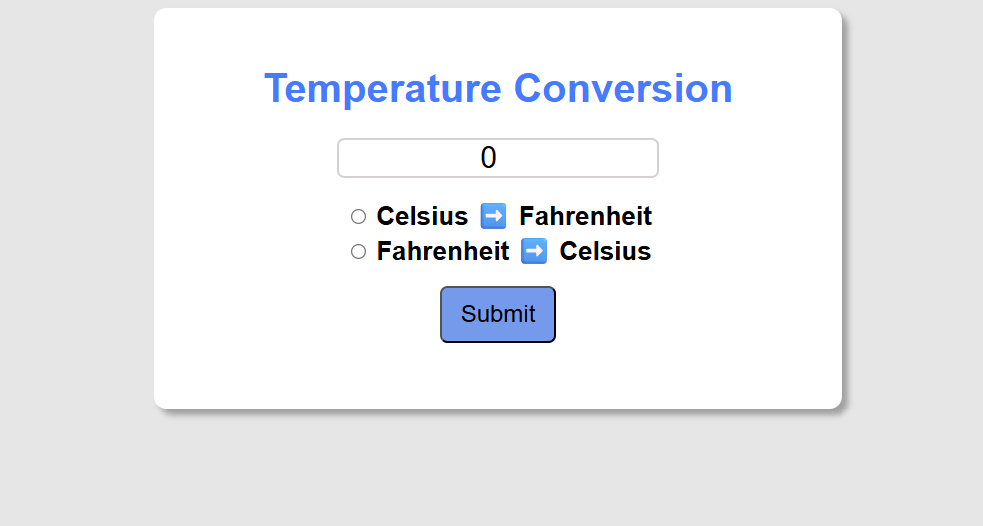

# 🌡️ Temperature Conversion Web App

A simple and responsive web application to convert temperatures between **Celsius** and **Fahrenheit**.
 ---
## 🚀 Features

* Convert **Celsius ➡️ Fahrenheit**
* Convert **Fahrenheit ➡️ Celsius**
* Clean and minimal **UI with CSS styling**
* Real-time **result display**
* Fully responsive and lightweight
 ---
## 🛠️ Tech Stack

* **HTML5** – Structure of the app
* **CSS3** – Styling and layout
* **JavaScript (Vanilla JS)** – Conversion logic
 ---
## 📂 Project Structure

```
├── index.html   # Main HTML structure
├── style.css    # Styles for UI
└── script.js    # Conversion logic
```
---
## 💻 How to Run

1. Clone or download this repository.
2. Open `index.html` in any modern browser.
3. Enter a temperature value, choose a conversion option, and click **Submit**.
---
## 🖼️ Preview

* Input a value in the textbox.
* Select a conversion option:

  * **Celsius ➡️ Fahrenheit**
  * **Fahrenheit ➡️ Celsius**
* Click **Submit** to see the result.
---
## 🔮 Future Improvements

* Add support for **Kelvin conversion**
* Improve **UI/UX with animations**
* Add **unit auto-detection**


---

## 📸 Screenshot

