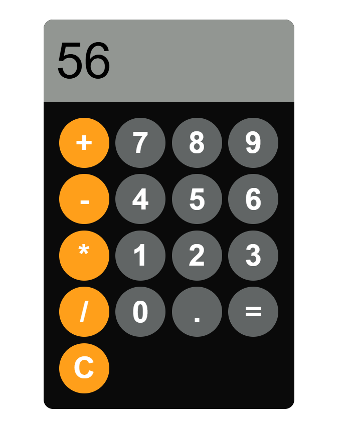

# 🧮 Calculator Web App

A simple calculator web application built using **HTML**, **CSS**, and **JavaScript**.
It performs basic arithmetic operations such as addition, subtraction, multiplication, and division with a clean UI.

---

## 🚀 Features

* ✅ Perform basic arithmetic operations (+, −, ×, ÷)
* ✅ Decimal point support
* ✅ Clear (`C`) button to reset calculations
* ✅ Error handling for invalid expressions
* ✅ Responsive design with styled buttons

---

## 📂 Project Structure

```
│── index.html     # HTML structure of the calculator
│── style.css      # Styling for layout and buttons
│── index.js       # Calculator functionality (JavaScript logic)
└── README.md    # Project documentation  

```

---

## 🖼️ Preview

The calculator UI looks like this:

* A display area at the top to show input and results.
* Number buttons (0–9), operator buttons (+, −, ×, ÷), decimal point, equal (=), and clear (C).

---

## ⚙️ Installation & Usage

1. Clone or download this repository:

   ```bash
   git clone https://github.com/your-username/calculator-project.git
   ```
2. Open the project folder:

   ```bash
   cd calculator-project
   ```
3. Run the application by simply opening **index.html** in any modern web browser.

---

## 💻 Technologies Used

* **HTML5** – structure of the calculator
* **CSS3** – styling and layout
* **JavaScript (ES6)** – logic for handling calculations

---

## 📸 Screenshots


---

## 🌐 Deployment

You can easily deploy this project using **GitHub Pages**, **Netlify**, or **Vercel**.

* for ex. 

   ```
   https://your-username.github.io/calculator-project/
   ```

---

## 🛠️ Future Improvements

* Add keyboard support for calculations
* Implement scientific functions (%, √, ^, etc.)
* Improve responsive design for mobile devices

---

## 📜 License

This project is open-source and available under the **MIT License**.
