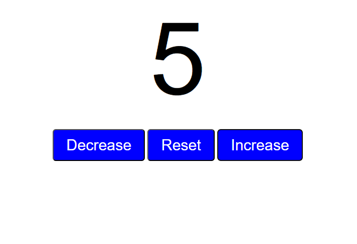

# Counter App

A simple web-based counter application built with **HTML**, **CSS**, and **JavaScript**.

## 🚀 Features

* Increase, decrease, and reset the counter.
* Smooth button hover effects.
* Minimal and clean UI.

## 📂 Project Structure

```
├── index.html   # Main HTML file  
├── style.css    # Styling for the counter app  
└── app.js       # JavaScript logic for counter functionality  
└── README.md    # Project documentation  
```

## 🖥️ How to Run

1. Clone or download this repository.
2. Open `index.html` in any web browser.
3. Use the **Increase**, **Decrease**, and **Reset** buttons to control the counter.

## 📸 Preview

Counter starts at **0** and updates instantly as you interact with the buttons.

## 🛠️ Tech Stack

* **HTML5**
* **CSS3**
* **JavaScript (Vanilla JS)**

## 📸 Screenshots
