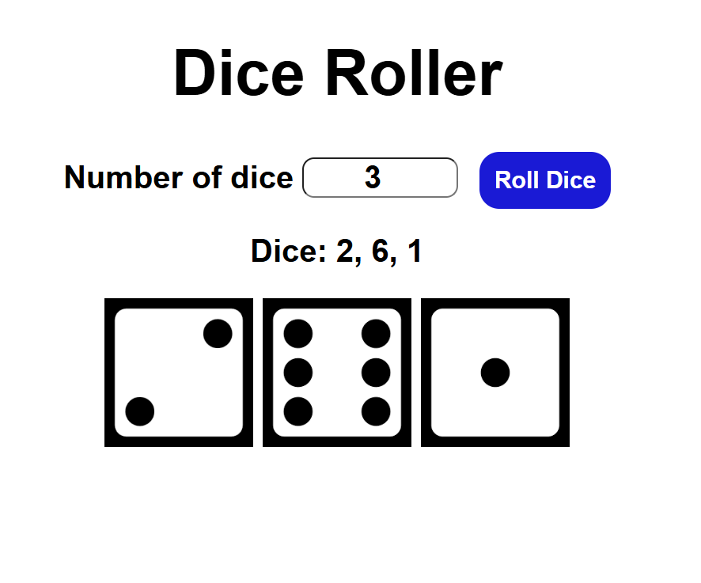

# 🎲 Dice Roller App

A simple and interactive Dice Roller built with **HTML**, **CSS**, and **JavaScript**.

## 🚀 Features

* Roll any number of dice.
* Displays both dice values and images.
* Responsive and clean UI with hover effects.

## 📂 Project Structure

```
├── index.html   # Main HTML file  
├── style.css    # Styling for the app  
└── app.js       # JavaScript logic for dice rolling 
└── README.md    # Project documentation   
```

## 🖥️ How to Run

1. Clone or download this repository.
2. Place dice images (`1.png` to `6.png`) inside `/myImages/` folder.
3. Open `index.html` in your browser.
4. Enter the number of dice and click **Roll Dice**.

## 🛠️ Tech Stack

* **HTML5**
* **CSS3**
* **JavaScript (Vanilla JS)**

## 📸 Screenshots

