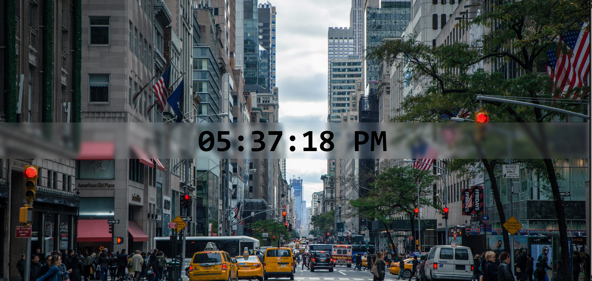

Here’s a clean and crisp **README.md** for your **Digital Clock** project:

---

# 🕒 Digital Clock

A simple **Digital Clock** built using **HTML**, **CSS**, and **JavaScript**.

## 🚀 Features

* Displays the current time in **12-hour format with AM/PM**.
* Updates automatically every second.
* Stylish background with blur effect for modern UI.

## 📂 Project Structure

```
├── index.html   # Main HTML file  
├── style.css    # Styling (background, layout, clock design)  
└── index.js     # JavaScript logic for updating the clock  
└── README.md    # Project documentation  
```

## 🖥️ How to Run

1. Clone or download this repository.
2. Make sure the background image (`city01.jpg`) is in the project folder.
3. Open `index.html` in your browser.
4. The digital clock will update automatically.

## 🛠️ Tech Stack

* **HTML5**
* **CSS3**
* **JavaScript (Vanilla JS)**

---
## 📸 Screenshots

