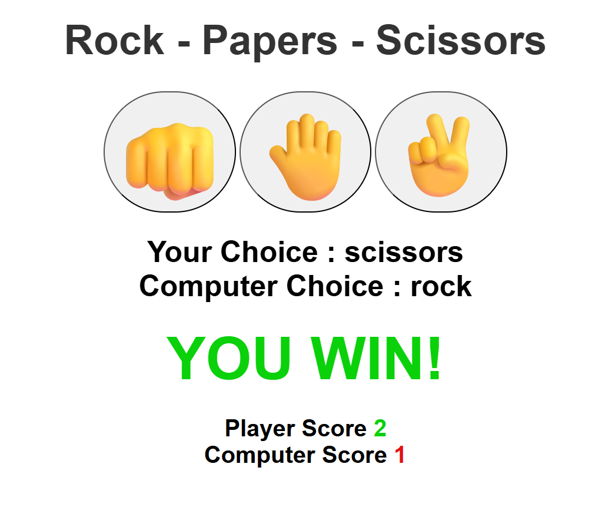

# Rock - Paper - Scissors 🎮✊🤚✌️

A simple **Rock-Paper-Scissors** game built with **HTML, CSS, and JavaScript**.
Play against the computer, track your score, and enjoy the classic game with a clean interface.

---

## 🚀 Features

* Interactive UI with big emoji buttons for Rock, Paper, and Scissors.
* Real-time display of player and computer choices.
* Score tracking for both player and computer.
* Dynamic result display with color feedback:

  * 🟢 Green when you win
  * 🔴 Red when you lose
  * Neutral for a tie

---

## 📂 Project Structure

```
.
├── index.html   # Main game structure (UI elements & buttons)
├── style.css    # Styling and layout
└── index.js     # Game logic and interactivity
└── README.md    # Project documentation  
```

---

## 🖥️ How to Run

1. Download or clone this repository.
2. Open the `index.html` file in your browser.
3. Start playing by clicking on Rock (👊), Paper (🤚), or Scissors (✌️).

---

## 🛠️ Tech Stack

* **HTML5** – structure
* **CSS3** – styling
* **JavaScript (Vanilla)** – game logic

---

## 🔮 Future Improvements

* Add a **reset button** to restart scores.
* Add **rounds system** (best of 3 / best of 5).
* Show **animations** for results.
* Make it **mobile-friendly** with better responsiveness.

---

## 📸 Screenshot



---


