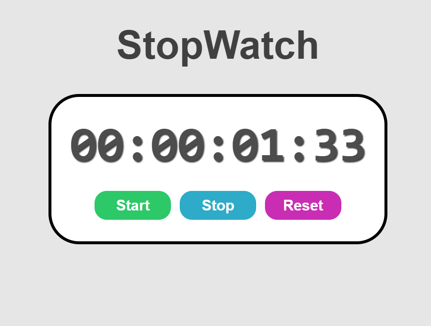

# ⏱️ Stopwatch App

A simple and stylish **Stopwatch** built using **HTML**, **CSS**, and **JavaScript**.

## 🚀 Features

* Start, Stop, and Reset functionality.
* Displays time in **hours : minutes : seconds : milliseconds**.
* Smooth button hover effects.
* Clean and minimal UI.

## 📂 Project Structure

```
├── main.html    # Main HTML file  
├── style.css    # Styling for the stopwatch  
├── index.js     # Stopwatch logic  
└── README.md    # Project documentation  
```

## 🖥️ How to Run

1. Clone or download this repository.
2. Open `main.html` in your browser.
3. Use the **Start**, **Stop**, and **Reset** buttons to control the stopwatch.

## 🛠️ Tech Stack

* **HTML5**
* **CSS3**
* **JavaScript (Vanilla JS)**

## 📸 Screenshot
