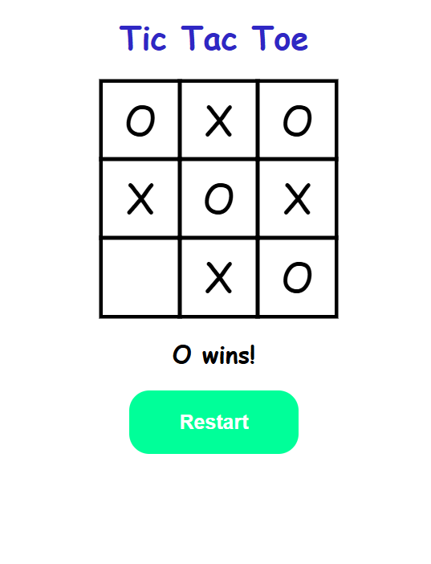

# 🎮 Tic Tac Toe Game

A simple and interactive **Tic Tac Toe** web game built using **HTML**, **CSS**, and **JavaScript**.  
It allows two players to take turns marking spaces in a 3×3 grid to achieve three in a row — horizontally, vertically, or diagonally.

---

## 🧩 Features

- Two-player local gameplay (Player X vs Player O)
- Displays current player's turn
- Detects win or draw conditions automatically
- “Restart” button to reset the board
- Responsive and minimalistic design

---

## 🛠️ Technologies Used

| Technology | Description |
|-------------|-------------|
| **HTML5** | For creating the basic structure of the game |
| **CSS3** | For styling and layout of the board and buttons |
| **JavaScript (ES6)** | For handling the game logic and interactivity |

---

## 📁 Project Structure

```

├── index.html       # Main HTML file (game layout)
├── style.css        # Stylesheet for UI design
└── index.js         # JavaScript file for game logic
└── README.md        # Project documentation  

```

---

## 🚀 How to Play

1. **Open** `index.html` in your browser.
2. Player **X** starts first.
3. Click any empty cell to place your mark.
4. Alternate turns between players until one wins or the game ends in a draw.
5. Click **Restart** to play again!

---

## 🧠 Game Logic Overview

- The game board is represented by an array of 9 elements.
- After each move, the program checks the predefined **winning combinations**.
- If a player wins, the game stops and displays a victory message.
- If all cells are filled with no winner, a **Draw** is declared.

---

## 🎨 Preview

| Game Layout |
|--------------|
|  |

---
